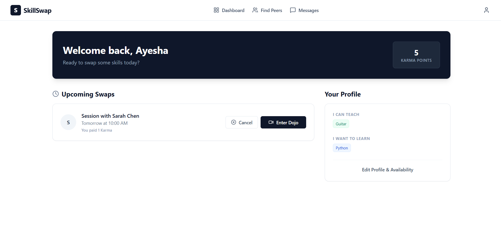
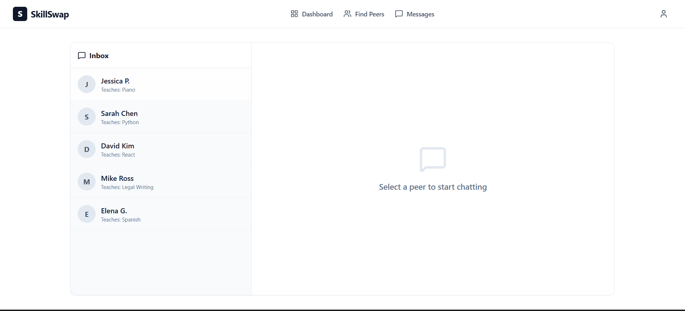
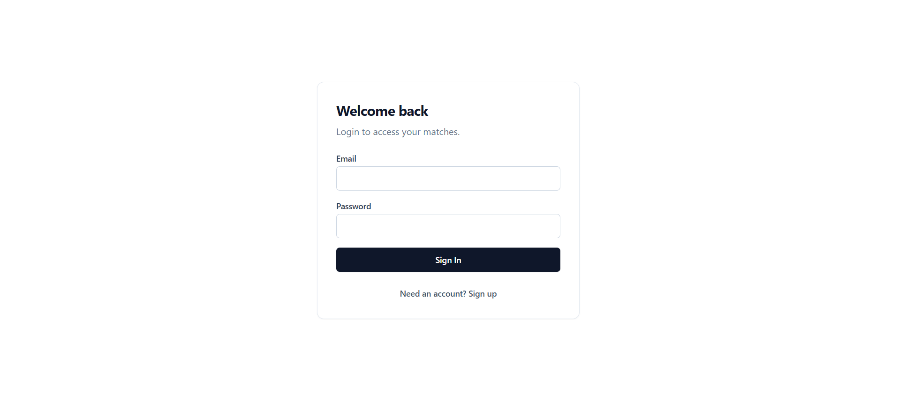
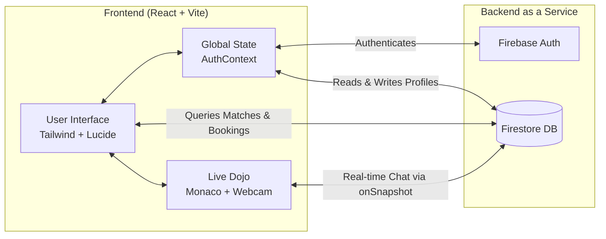

🚀 SkillSwap
============

### *The Currency of Knowledge. Stop Paying. Start Swapping.*

🔗 **Live Demo:** <https://doskillswap.vercel.app>

* * * * *

📖 The Vision
-------------

### The Problem

Learning is a superpower, but finding the right people to learn from or teach can feel lonely and frustrating.

SkillSwap was built to create more than just another app. It's a welcoming community where people connect, exchange skills, and grow together.

### The Solution

SkillSwap is a decentralized, peer-to-peer learning platform that removes the financial barrier to education.

Everyone is an expert at something, and a beginner at something else.

Instead of paying $50/hour for lessons, SkillSwap uses:

-   A smart matching algorithm

-   A barter-based Karma economy

to connect learners directly.

* * * * *

# 🖼️ App Gallery

## Dashboard & Smart Matching

---

# 🎥 The Live Dojo

## Code Mode

## Notes Mode

---

# 💬 Messaging & Authentication

---

## 🎥 Demo Video

Watch a 2-minute walkthrough of the full platform:

[▶️ Watch the Demo](https://youtu.be/VVe2opNaZKE)

🏗️ Architecture & Data Flow
============================

⚙️ Architecture Overview
------------------------

SkillSwap is built on a **Serverless Real-Time Architecture**:

-   **Reactive UI**\
    Built with React 18 and Vite, styled using Tailwind CSS for a fast, responsive interface.

-   **Real-Time Backbone**\
    Firebase Firestore `onSnapshot` listeners power messaging and Dojo synchronization without page refreshes.

-   **State Management**\
    A custom React Context API handles global authentication state and Karma transactions.

* * * * *

✨ Features
==========

🧠 Smart-Match Engine
---------------------

Automatically finds your ideal partner.

If you want to:

-   Learn **Python**

-   Teach **Guitar**

SkillSwap surfaces users who:

-   Want to learn Guitar

-   Can teach Python

Ranked by compatibility.

* * * * *

🛡️ The Karma Economy
---------------------

-   Every user starts with **5 Karma**

-   Spend **1 Karma** to book a session

-   Earn **1 Karma** when you teach

This:

-   Prevents "leeching"

-   Rewards knowledge sharing

-   Is enforced via secure Firestore increment transactions

* * * * *

⚡ The Live Dojo
---------------

An immersive in-browser learning space, no external Zoom links required.

Includes:

-   WebRTC video chat

-   Real-time messaging

-   Monaco Code Editor (for technical skills)

-   Shared Notes mode (for languages, arts, etc.)

* * * * *

📅 Frictionless Scheduling
--------------------------

-   Users define weekly availability

-   Booking dynamically loads available slots

-   Karma transactions are handled automatically

* * * * *

💬 Real-Time Inbox
------------------

Continue conversations outside the Dojo using Firestore-powered instant messaging.

* * * * *

🛠️ Engineering & Tradeoffs
===========================

🧩 Technical Challenges
-----------------------

### The "White Flash" UX

The dashboard initially flashed white while authentication and profile data loaded.

**Solution:**

-   Implemented a global loading state in AuthContext

-   Created a custom `<Loader2 />` skeleton UI

-   Maintained visual continuity for a premium feel

* * * * *

### Deterministic Chat Room IDs

To ensure two users always land in the same chat:

[uid1, uid2].sort().join("_")

This prevents duplicate chat threads in Firestore.

* * * * *

⚖️ Tradeoffs
------------

### Firestore vs Custom WebSocket Server

**Chosen:** Firestore real-time listeners\
**Alternative:** Node.js + Socket.io

While WebSockets provide slightly lower latency, Firestore:

-   Enabled faster iteration

-   Removed server management

-   Kept the app fully serverless

-   Scales automatically

* * * * *

### Client-Side Matching (V1)

Currently runs on the client for simplicity.

Future plan:

-   Move matching logic to Firebase Cloud Functions

-   Reduce client bundle size

-   Improve scalability

* * * * *

📈 Scaling Roadmap
==================

### 🔄 Dojo Synchronization

Currently, code and notes are local state.

Future upgrade:

-   Integrate **Yjs** or Firestore-based CRDTs

-   Enable true multi-user collaborative editing (Google Docs style)

* * * * *

### 🔐 Karma Integrity

To prevent Karma farming:

Future implementation:

-   Both users must confirm session completion

-   Karma transfers only after dual verification

* * * * *

💻 Tech Stack
=============

Built for performance, scalability, and developer velocity.

**Frontend:**

-   React (Vite)

**Styling:**

-   Tailwind CSS

**Icons:**

-   Lucide-React

**Backend & Authentication:**

-   Firebase Authentication

-   Firebase Firestore

**IDE Integration:**

-   @monaco-editor/react

**Video Integration:**

-   react-webcam

* * * * *

🚀 Getting Started (Local Development)
======================================

1️⃣ Clone the Repository
------------------------

git clone https://github.com/dlawiz83/SkillSwap.git
cd SkillSwap

* * * * *

2️⃣ Install Dependencies
------------------------

npm install

* * * * *

3️⃣ Environment Variables
-------------------------

Create a `.env` file in the root directory:

VITE_FIREBASE_API_KEY=your_api_key\
VITE_FIREBASE_AUTH_DOMAIN=your_auth_domain\
VITE_FIREBASE_PROJECT_ID=your_project_id\
VITE_FIREBASE_STORAGE_BUCKET=your_storage_bucket\
VITE_FIREBASE_MESSAGING_SENDER_ID=your_messaging_sender_id\
VITE_FIREBASE_APP_ID=your_app_id

* * * * *

4️⃣ Run the Development Server
------------------------------

npm run dev

The app will be running at:

http://localhost:5173

* * * * *

🤝 Contributing
===============

SkillSwap is open-source.

If you'd like to:

-   Add a feature

-   Fix a bug

-   Improve performance

-   Suggest enhancements

Open a Pull Request; contributions are welcome.

* * * * *

📜 License
==========

Distributed under the MIT License.\
See the `LICENSE` file for more information.
