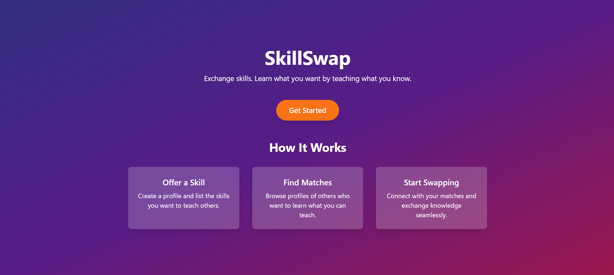
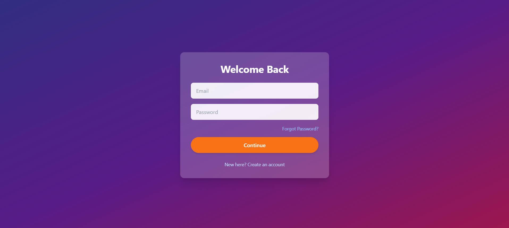
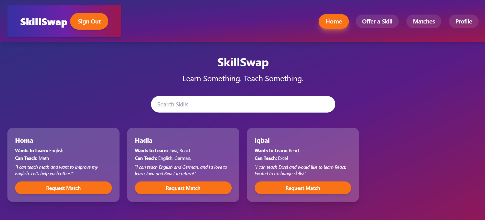
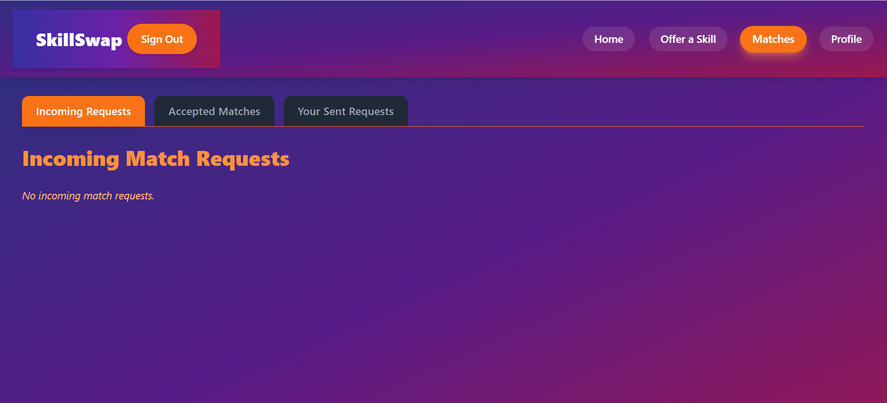

# SkillSwap

SkillSwap is a community-driven web platform that connects learners and teachers by matching users who want to learn new skills with others willing to teach those skills. It encourages peer-to-peer knowledge exchange to empower community growth.

## Problem

Finding trustworthy, motivated people to learn new skills from or teach to is often difficult, especially without a centralized platform for direct connections.

## Solution

SkillSwap solves this by enabling users to create skill profiles showing what they want to learn and teach. Users can browse profiles, send match requests, and chat in real time to coordinate learning sessions, fostering a collaborative learning community.

## Key Features

- **Search & Discovery:** Filter users by skills to learn or teach  
- **Match Requests:** Send and manage skill exchange requests  
- **Request Management:** Accept or reject incoming requests with status tracking  
- **Accepted Matches:** Access chat with matched users  
- **Real-time Chat:** Seamless communication within the platform  

## Technologies Used

- **React + Vite** – Frontend UI with reusable components  
- **Firebase Authentication** – Secure user sign-in and authorization  
- **Firebase Firestore** – NoSQL database for profiles, matches, and chat data  
- **Firestore Real-time Listeners** – Live updates on requests and chat  
- **React Router** – Navigation between pages  
- **Tailwind CSS** – Utility-first responsive styling  
- **JavaScript (ES6+)** – Core frontend logic and Firebase integration  

## Live Demo

[https://skill-swap-rosy-alpha.vercel.app/](https://skill-swap-rosy-alpha.vercel.app/)

## Screenshots

### About Page

### Login Screen

### Home Page

### Match

